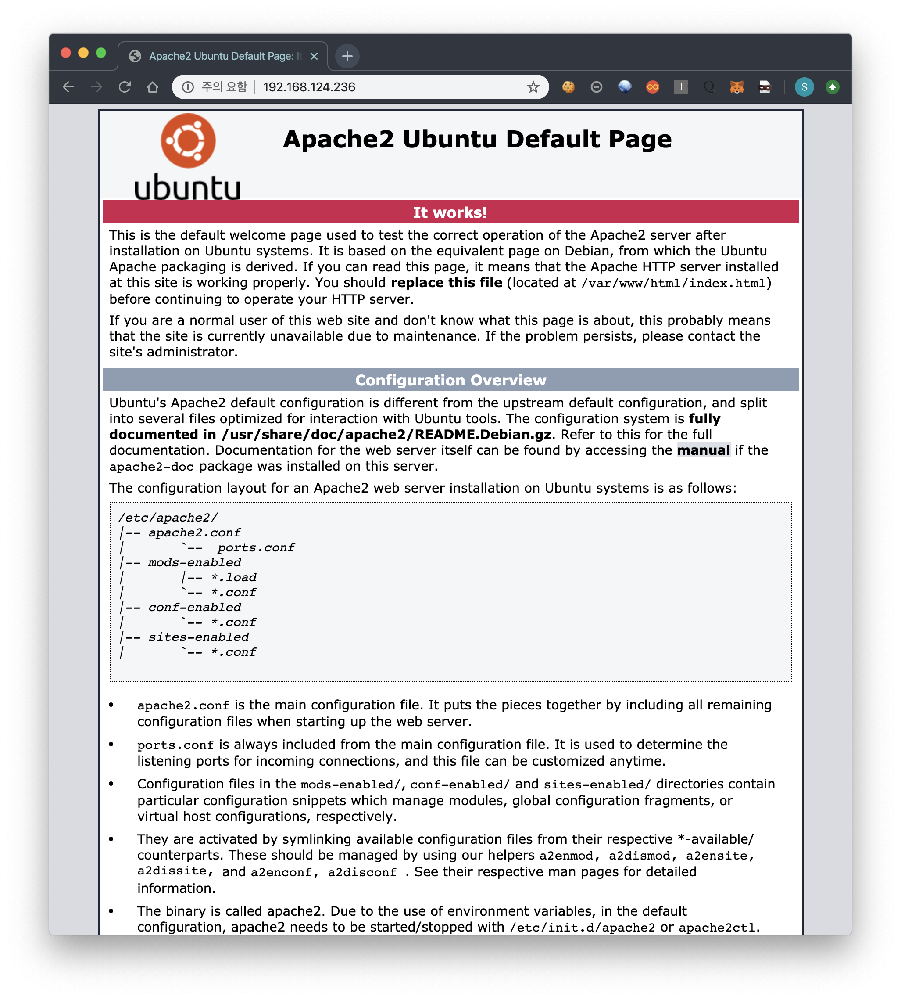

# LAMP Stack

LAMP는 **L**inux, **A**pache, **M**ySQL, **P**HP의 약자입니다.

보통, 웹을 만들기 위해서는 운영체제와 웹서버, 데이터베이스, 서버 프로그램이 필요합니다.  Linux는 운영체제, Apache는 웹서버, MySQL은 Database, PHP는 서버 프로그램입니다.

LAMP 스택은, 그러한 요소들의 조합 중 하나라고 보시면 됩니다. LAMP 스택을 사용하지 않고, 개발자의 역량이나 서비스의 용도에 따라, Apache 웹서버 대신 Nginx 웹서버를 사용해도 되고 PHP 대신 Python을 사용해도 됩니다.

우리 멘토링에서는 가장 많이 사용되는 조합 중 하나인 LAMP 스택을 기준으로 멘토링을 진행할 것입니다. LAMP 스택을 설치해보고, 실습을 통해 웹서버, 데이터베이스, 서버프로그램이 무엇인지 몸소 체험해볼 예정입니다. 


## Linux Installation

여러분 컴퓨터의 운영체제는 보통 Windows일겁니다. 맥북을 사용하시는 분들은 macOS일텐데 소수일 것이고, 리눅스를 사용하는 사람들은 극소수겠죠? 멘토링에서의 실습을 위해서는 리눅스를 설치해야 합니다. 방법은 여러가지가 있습니다.

1. 윈도우를 지우고 리눅스를 설치한다.
2. 디스크 파티션을 나눠서 멀티 부팅 환경을 만든다.
3. Virtual Machine을 사용한다.

1번 방법을 선택하면 여러분은 윈도우를 못 쓰게 됩니다. 온라인 쇼핑을 하거나 한글 문서~~(적폐)~~를 작성하려면 다른 컴퓨터를 사용해야 하는 상황이 벌어집니다.

2번 방법은 1번 방법의 대안이 됩니다. 하지만 처음 설치해보는 사람들에게는 조금 어려울 수 있습니다. 인터넷 보고 따라하면 되긴 하지만, 디스크 파티션을 나누고 부팅 설정을 건드려야 합니다. ~~(위대하신 김현수 수령 동지께서는 1학년 초에 이걸 해냈습니다)~~

3번 방법은 위 두가지 방법의 단점을 모두 해결해줍니다. 처음 하는 사람들에게는 어려울 수 있겠지만 설치도 훨씬 쉽고, 심지어 윈도우랑 리눅스를 실시간으로, 동시에 사용할 수 있습니다. 단점이라면 컴퓨터가 열일을 한다는 점입니다. 운영체제 2개를 동시에 사용하면 CPU랑 메모리가 많이 필요하겠죠? 그래서 VM을 돌리는 동안에는 컴퓨터가 조금 느려질 수도 있습니다. 하지만 우리 목표는 공부니깐 괜찮습니다^^


### Virtual Machine

Virtual Machine은 보통 VM 또는 가상 머신이라고 부릅니다. 컴퓨터는 CPU, 메모리 등 여러가지 하드웨어로 구성되어 있죠? VM은 이러한 하드웨어를 가상으로 구현하여 가상 컴퓨터를 만들어 놓은 것이라고 이해하시면 됩니다. CPU 같은 하드웨어 요소를 하나씩 프로그램으로 구현해서 돌리는겁니다.


위는 실제로 macOS에 VM을 이용하여 리눅스를 설치한 모습입니다. VM을 이용하면 이처럼 2개의 OS를 동시에 사용할 수 있습니다. VM 바깥 OS를 host OS, VM 안의 OS를 guest OS라고 부릅니다. 위 사진에서는 macOS가 호스트 OS, 리눅스가 게스트 OS가 되겠죠?

VM을 구현한 소프트웨어는 여러가지가 있습니다. VMware, Virtual Box, Parallels가 대표적입니다. 이 중 무료 소프트웨어는 Virtual Box입니다. 나머지는 유료 소프트웨어입니다. 저는 VMware를 추천합니다. 멘토링도 VMware 기준으로 진행할 예정이고 써보시면 무료가 무료인 이유와 유료가 유료인 이유를 알 수 있을 겁니다 +_+

아마 지금은 VM에 대해 이해가 잘 안될 수도 있어요. 아마 4학년 쯤 되면 어느 정도 이해가 될겁니다 ㅋㅋㅋ 깊게 이해하려고 하면 밑도 끝도 없이 깊어지니 지금은 이 정도만 이해하고 넘어가도 됩니다. ~~여담이지만 VM 회사에서 일하시는 분들은 컴퓨터의 끝판왕 분야에서 일을 하시는 분들이 아닐까 싶습니다.~~ 


### Ubuntu 18.04 on VMware

Ubuntu 18.04를 설치해주세요. [우분투 공식사이트](<https://releases.ubuntu.com/18.04.4/>) 또는 [제 구글 드라이브](https://drive.google.com/open?id=1j1cVjZyCQ2hS1RjjAr1pOHRaOXzjE7YX)에서 iso 파일을 다운로드 받아주시고, VM에 우분투를 설치해주세요. 그리고 VMware는 알아서 잘 구하실 수 있을거라고 믿습니다 ^^..

macOS라서 윈도우랑 조금 다를텐데 그냥 iso 파일 선택하고, '다음' 또는 'next'만 눌러주면 됩니다. 한번씩 읽어보면서 설치하시면 됩니다. 모르는게 있으면 저에게 물어보거나, 정리가 잘 되어있는 게시물들이 많으니 검색을 통해서 해결하시면 됩니다. (구글링 키워드: vmware ubuntu 설치)


설치가 끝났다면 [여기](<http://jjy0501.blogspot.com/2018/08/1804-vmware-tools.html>)를 참고하셔서 VMware Tools까지 설치해주세요. 그래야 리얼머신과 가상머신의 파일 공유, 클립보드 공유가 편해집니다.


#### Shell Basic

터미널을 열어서 리눅스를 아주 간단하게 사용해봅시다. (터미널 창 단축키: Ctrl + Alt + T)

터미널이 켜지면 다음의 문구가 뜨는 것을 확인할 수 있습니다.

```shell
d@ubuntu:~$ 
```

이걸 쉘이라고 하고 쉘은 우리와 운영체제를 연결해주는 역할을 합니다. 사람이 컴퓨터랑 대화할 수 있도록 해주는거라고 이해하고 넘어가도 됩니다.

여기서 여러가지 명령어를 쳐볼 수 있습니다.

```shell
d@ubuntu:~$ echo "Hello"
Hello
```

`echo` 는 출력을 해주는 명령어입니다. `C`에서는 `printf` 함수, `python`에서는 `print` 함수 역할인거죠.

```shell
d@ubuntu:~$ mkdir test
d@ubuntu:~$ ls
Desktop    Downloads         Music     Public     test
Documents  examples.desktop  Pictures  Templates  Videos
d@ubuntu:~$ ls -l
total 48
drwxr-xr-x 2 d d 4096 May  9 22:05 Desktop
drwxr-xr-x 2 d d 4096 May  9 22:05 Documents
drwxr-xr-x 2 d d 4096 May  9 22:05 Downloads
-rw-r--r-- 1 d d 8980 May  9 22:01 examples.desktop
drwxr-xr-x 2 d d 4096 May  9 22:05 Music
drwxr-xr-x 2 d d 4096 May  9 22:05 Pictures
drwxr-xr-x 2 d d 4096 May  9 22:05 Public
drwxr-xr-x 2 d d 4096 May  9 22:05 Templates
drwxr-xr-x 2 d d 4096 May  9 22:40 test
drwxr-xr-x 2 d d 4096 May  9 22:05 Videos
```

`mkdir`은 디렉토리를 만드는 명령어입니다. `ls`는 리스팅을 해주는 명령어입니다. 위는 test라는 디렉토리를 만들고 디렉토리가 만들어졌는지 확인하는 과정인거죠. `ls -l` 은 `ls`  명령어에 더 자세히 표시해달라는 옵션을 준겁니다. 파일 유형, 파일 권한, 파일 크기, 만들어진 시간 등이 표시가 됩니다.

```shell
d@ubuntu:~$ cd test
d@ubuntu:~/test$ ls -l
total 0
d@ubuntu:~/test$ pwd
/home/d/test
```

`cd`는 디렉토리를 옮기는 명령어입니다. 위는 test라는 디렉토리로 이동한 후 어떤 파일이 있는지 확인한 것입니다. 디렉토리를 만들고 안에서 아무 행위도 안했으니 당연히 `total 0`으로 아무 파일도 없겠죠? `pwd`는 현재의 위치를 알려주는 명령어입니다. 현재 `/home/d/test` 위치에 있다고 출력되었죠?

이제 텍스트 에디터를 설치해봅시다.

```shell
d@ubuntu:~/test$ sudo apt install vim
```

`sudo`는 root 권한으로 실행하라는 의미입니다. 운영체제는 보안을 위해 권한을 나눠두는데, root는 리눅스 운영체제에서 최상위 권한을 가진 계정입니다. 중요한 기능을 수행하기 위해서는 root 권한이 꼭 필요합니다. `sudo [명령어]` 형식으로 사용하게 되고, 명령어를 root 권한으로 수행해줍니다. `apt`는 프로그램을 설치하고 삭제하는 데에 사용됩니다. `apt install [패키지명]`을 치면 원격 저장소에서 파일을 검색하고 다운로드 받아와서 컴퓨터에 설치해줍니다.  `sudo apt install vim`을 쳤으니 root 권한으로 vim을 설치하라는 의미가 됩니다.

```shell
d@ubuntu:~/test$ touch test.txt
d@ubuntu:~/test$ ls -l
total 0
-rw-r--r-- 1 d d 0 May  9 22:51 test.txt
```

`touch`는 파일을 생성해주는 명령어입니다. test.txt라는 파일이 만들어진 것을 확인할 수 있죠? 이제 `vim`을 이용하여그 파일에 내용을 적어볼겁니다.

```shell
d@ubuntu:~/test$ vim test.txt
```

`vim` 은 텍스트 에디터입니다. 윈도우로 치면 notepad와 비슷합니다. 위는 test.txt를 열겠다는 의미입니다.


명령어를 치면 위처럼 파일이 열리는데 여기서 `i`를 치면 Insert 모드로 들어갑니다.


파일에 내용을 작성하고 esc를 누르면 insert 모드에서 빠져나옵니다.


 `:w` 를 치면 저장이 됩니다.


마지막으로 `:q`치면 vim 에디터에서 빠져나옵니다. 저장과 동시에 나오려면 `:wq`를 쳐도 됩니다.

아주 기본적인 리눅스 명령어를 소개해드렸습니다. 


#### VMware Tools 설치 확인

마지막으로 가상머신과 리얼머신의 클립보드 공유가 되는지도 확인해봅시다.


게스트 OS에서 호스트 OS로, 호스트 OS에서 게스트 OS로, 둘다 복사-붙여넣기가 잘 되는지 확인해주세요. (파일도 동일한 방법으로 복사-붙여넣기가 가능합니다.) 만약에 안된다면 공유 설정이 잘못 되었거나 VMware Tools가 설치되지 않은 것입니다. 

다음 명령어를 통해 VMware tools가 설치되었는지 확인 가능합니다.

```shell
d@ubuntu:~$ which vmware-user
/usr/bin/vmware-user
```

`/usr/bin/vmware-user` 가 뜨지 않는다면 설치가 되지 않았다는 의미이므로 다시 설치해주시면 됩니다. 설치가 잘 되었다면 VM 설정에 들어가셔서 공유 설정을 확인해주세요.


## Apache Installation

아파치는 웹서버라고 위에서 설명했었죠? 다음 명령어를 통해 설치할 수 있습니다.

```shell
d@ubuntu:~/test$ sudo apt install apache2
```

설치가 다 됐으면 웹서버가 작동하는지 확인해봅시다.


왼쪽 위에 firefox 브라우저를 켜서 `localhost` 또는 `127.0.0.1`에 접속해보세요. 위처럼 뜬다면 아파치가 정상 설치됐고 잘 작동한다는 의미입니다. 

호스트 OS에서도 접속이 가능합니다

```shell
d@ubuntu:~/test$ sudo apt install net-tools
d@ubuntu:~/test$ ifconfig
```

위 명령어를 친 후 아이피를 확인해봅시다.


제 VM의 아이피는 `192.168.124.236`으로 확인됩니다.



해당 아이피를 복사해서 호스트OS의 브라우저에서 접속해보면 위처럼 접속되는 것을 확인할 수 있습니다.


### PHP Installation

