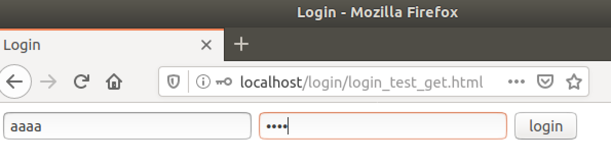
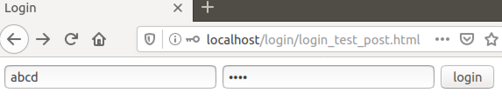
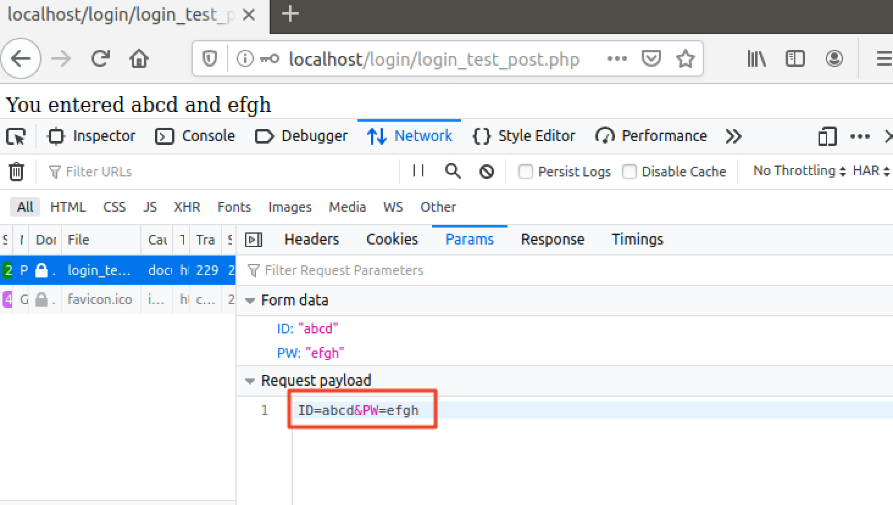
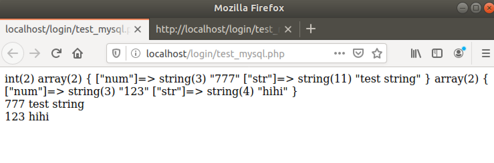

# 회원가입 / 로그인

LAMP 스택 설치에 이어서, LAMP 스택을 이용하여 로그인과 회원가입 기능을 구현해볼 것입니다.


## HTML-PHP 파라미터 전달 실습

login_test_get.html

```html
<html>
	<head>
		<title>Login</title>
	</head>
	<body>
		<form name="loginForm" action="login_test_get.php">
			<input type="text" name="ID" value="ID" >
			<input type="password" name="PW">
			<input type="submit" value="login">
		</form>
	</body>
</html>
```


login_test_get.php

```php
<?php 
	$ID = $_GET['ID'];
	$PW = $_GET['PW'];
	if($ID && $PW){
        echo "You entered " . $ID . " and " . $PW;
	}
	else{
		echo "<script>alert(\"No ID or PW\");</script>";
	}
?>
```





login_test_post.html

```html
<html>
	<head>
		<title>Login</title>
	</head>
	<body>
		<form name="loginForm" action="login_test_post.php" method='post'>
			<input type="text" name="ID" value="ID" >
			<input type="password" name="PW">
			<input type="submit" value="login">
		</form>
	</body>
</html>
```


login_test_post.php

```php
<?php 
	$ID = $_POST['ID'];
	$PW = $_POST['PW'];
	if($ID && $PW){
        echo "You entered " . $ID . " and " . $PW;
	}
	else{
		echo "<script>alert(\"No ID or PW\");</script>";
	}
?>
```








## MySQL 실습

```
d@ubuntu:/var/www/html/login$ mysql -u user -p
Enter password: 
Welcome to the MySQL monitor.  Commands end with ; or \g.
Your MySQL connection id is 5
Server version: 5.7.30-0ubuntu0.18.04.1 (Ubuntu)

Copyright (c) 2000, 2020, Oracle and/or its affiliates. All rights reserved.

Oracle is a registered trademark of Oracle Corporation and/or its
affiliates. Other names may be trademarks of their respective
owners.

Type 'help;' or '\h' for help. Type '\c' to clear the current input statement.

mysql> show databases;
+--------------------+
| Database           |
+--------------------+
| information_schema |
| test               |
+--------------------+
2 rows in set (0.01 sec)
```


```
mysql> use test;
Database changed
mysql> show tables;
Empty set (0.00 sec)
```


```
mysql> create table test_table(num int, str varchar(32));
Query OK, 0 rows affected (0.03 sec)

mysql> show tables;
+----------------+
| Tables_in_test |
+----------------+
| test_table     |
+----------------+
1 row in set (0.00 sec)
```


```
mysql> insert into test_table(num, str) values (777, "test string");
Query OK, 1 row affected (0.01 sec)

mysql> select * from test_table;
+------+-------------+
| num  | str         |
+------+-------------+
|  777 | test string |
+------+-------------+
1 row in set (0.00 sec)
```


```
mysql> insert into test_table(num, str) values (123, "hihi");
Query OK, 1 row affected (0.00 sec)

mysql> select * from test_table;
+------+-------------+
| num  | str         |
+------+-------------+
|  777 | test string |
|  123 | hihi        |
+------+-------------+
2 rows in set (0.00 sec)

mysql> select * from test_table where num=123;
+------+------+
| num  | str  |
+------+------+
|  123 | hihi |
+------+------+
1 row in set (0.00 sec)

mysql> select * from test_table where str="hihi";
+------+------+
| num  | str  |
+------+------+
|  123 | hihi |
+------+------+
1 row in set (0.00 sec)

mysql> select * from test_table where str like "te%";
+------+-------------+
| num  | str         |
+------+-------------+
|  777 | test string |
+------+-------------+
1 row in set (0.00 sec)

mysql> select * from test_table where str like "%ih%";
+------+------+
| num  | str  |
+------+------+
|  123 | hihi |
+------+------+
1 row in set (0.00 sec)
```


## PHP에서 MySQL 실습

test_mysql.php

```php
<?php 
	error_reporting(E_ALL);
	ini_set("display_errors", 1);

	$conn = mysqli_connect("localhost", "user", "Qwer1234!", "test");
	$result = mysqli_query($conn,"SELECT * FROM test_table");

	var_dump($result->num_rows);
	while ($row = $result->fetch_assoc()) {
		var_dump($row);
	}

	$result = mysqli_query($conn,"SELECT * FROM test_table");

	while ($row = $result->fetch_assoc()) {
		echo "</br>";
		echo $row['num'];
		echo " ";
		echo $row['str'];
	}
?>
```


